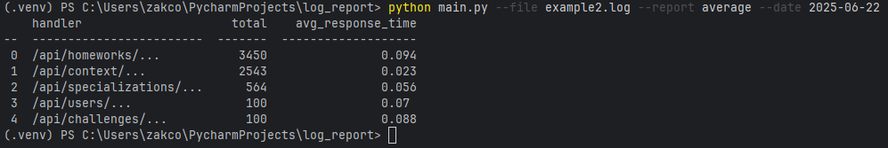

# Пример запуска

python main.py --file example1.log --report average --date 2025-06-22

# Отчёты проекта log_report

# Отчёт average для example1.log дата 2025-06-22

Это среднее время ответа по обработчикам из файла example1.log.

# Отчёт average для example2.log дата 2025-06-22

Среднее время ответа по обработчикам из файла example2.log.

# Отчёт user_agents для example1.log дата 2025-06-22

Количество обращений по User-Agent из файла example1.log.

# Отчёт user_agents для example2.log дата 2025-06-22

Количество обращений по User-Agent из файла example2.log.

# Результаты тестов pytest

Все тесты прошли успешно (5 тестов).

